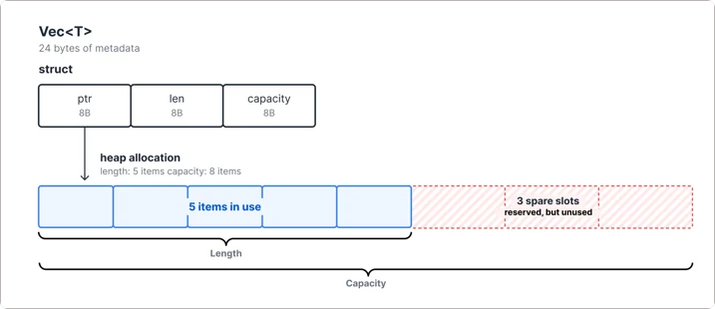
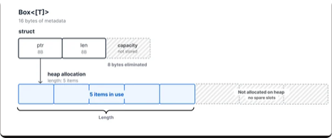
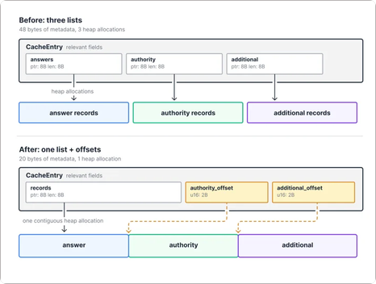
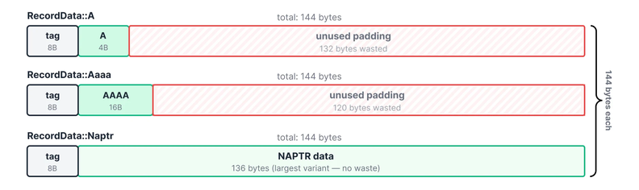
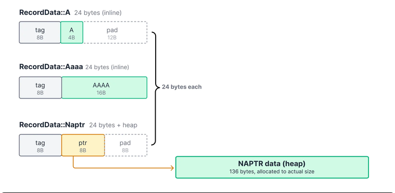
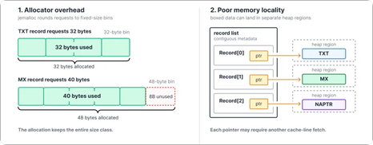
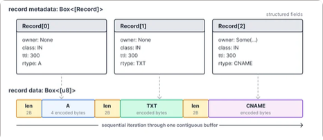
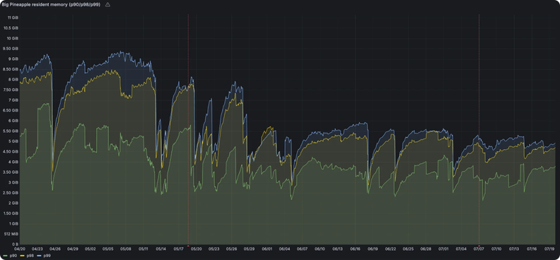

# CF优化文章解读

> **https://blog.cloudflare.com/dns-cache-memory-optimization-1111/**
> 原文

CloudFlare 存在一个引擎Big Pineapple（后面缩写为BPA），它是 1.1.1.1、Gateway DNS、DNS Firewall、AS112 以及其他多个 Cloudflare DNS 服务平台, 可随时存储超过 2500 亿个 DNS 缓存条目。在如此规模的情况下,每次单次浪费一次字节,整个团队的内存成本超过250GB。而这篇文章主要详细解读一下具体的优化

BPA在冷启动开始有一个空缓存。DNS查询到达后,缓存会填满,直到达到最大输入量,此时会清理一些较旧的内容。

在他们的缓存中的每个项都是一个键值对。KEY识别所查询的内容结构体如下:

``` rust
pub struct CacheKey {
    qname: Name,
    qtype: Rtype,
    authenticated: bool,
    tag: Vec<u8>,
}
```

另一个需要改造的数组是
```rust
pub struct CacheEntry {
    timestamp: UnixTimeStamp,
    pub inception: Instant,
    pub ttl: Ttl,
    pub hits: u32,
    pub answers: Vec<Record>,
    pub authority: Vec<Record>,
    pub additional: Vec<Record>,
    pub errors: Vec<ExtendedError>,
    ...
}
```

这两个结构是创建量高的热点结构，对他们进行优化可以又很高的优化效果
## Vec的优化

在rust的设计中Vec的字段分为三个部分，ptr、len、capacity。其中capacity是用于记录申请的heap堆的容量的，可以作为扩容和判断的标志。



但在DNS resopnse in cache 中，一旦这个值被记录创建，他就不会再进行长度上的修改，使用 `Box<[T]>` 解决了这两个问题。创建后无法生长,因此不需要容量字段,也不需要为未来元素预留空间。同样适用于String,它还带有容量字段。`Box<str>`  丢弃它。
同时它还消除了Vec为未来增长保留的多余堆内存。

## 更少的Lists和指针

在CacheEntry中，anwser、authority和additonal 部分存储在不同的列表中。这导致了每一个结构都带了一个胖指针，我们可以将单个列表与偏移点一起存储到每个部分的开头。由于每个部分的 DNS 记录计数为 u16,因此每个偏移量可以使用 u16(2 字节)。


这样的优化一个是减少的内存的使用量，从24B减少为12B，其次是减少了申请堆分配的次数，由3此转为1次，当然，代价是正常查找的时候需要同时读两个内容的和作为地址去跳转，查询速度上会比以前慢一点。

## Enum Sizing

> rust的Enum的设计是这样的：
> enum 就是 tagged union，等价于：
>```rust
// Reference 原文示例（repr(C) 时）
struct MyEnumRepr {
    tag: MyEnumDiscriminant,   // 判别值（tag）
    payload: MyEnumFields,     // 各变体字段的 union
}
>```
>Reference 对默认表示只保证：
>1. 字段的偏移量能被该字段的对齐值整除；
>2. 类型的对齐 ≥ 所有字段对齐的最大值。

那么在CacheEntry中存在的RecordData的大小也就以最长的字段一致了，但最长的字段NAPTR只有他本身是很长的，也就是说，即使我们要创建一个A Enum，需要的空间也是和NAPTR一致的。
```rust
pub enum RecordData {
    A(Ipv4Addr),
    Aaaa(Ipv6Addr),
    Txt(Txt),
    Naptr(Naptr),
    Svcb(Svcb),
    // ...
}
```

所以在图里看起来是这样的，会有很多为利用空间

为了解决这个问题，同样可以使用Box指针才处理这个问题，给他套上box指针，这样enum的最大的大小就会缩小。


## 以线性格式存储Record

使用 Box 有两个cost。第一是allocator overhead。每个Box变体都会变成单独的堆分配,而分配器则会将其固定到最近的大小类。BPA使用 jemalloc,这是一种专为多线程、分配繁重的工作量设计的分配器。jemalloc 将类似尺寸的分量组合成固定尺寸的垃圾箱。TXT 记录请求 32 字节,并精确拟合到 32 字节的单元格中,但 MX 记录请求的是 40 字节,最多需要 48 个字节,浪费 8 字节。（这一步分可以详见pwn->堆->bin相关的内容来了解具体MX分配）

第二个成本是memory locality比较差。没有Box,缓存条目的记录枚举值会以单个连续的分配方式为准。Box中,每个盒装变异株的数据都位于一个独立的堆区。阅读它需要遵循一个指针,当指针距离条目其余部分较远时,CPU必须获取一个新的缓存行。由于缓存条目数百万,盒装数据最终分散在堆中,而非打包在一起。



处理的方法是使用`Box<[u8]>` 自检了一个字节流，通过单次创建字节流，并模仿德式字符串的设计，在结束时将下一次的指针传递，在内存创建上减少的分块利用率低和碎片的问题。



## 效果

这是cf给出的优化后结果，可以看到在峰值上时确实有很高的优化

