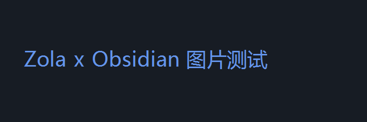

这是迁移到 Zola 后的第一篇文章。写法和利刃笔记完全一样：

- 文章放在 `blog/posts/` 下，就是一个普通的 md 文件
- 用 Obsidian 粘贴图片，会自动存到同名的 `.assets` 文件夹
- 本地 Obsidian 预览和线上网页显示效果一致

## 图片测试

下面这张图就在旁边的 `hello-zola.assets/` 文件夹里：



## 代码测试

```rust
fn main() {
    println!("Hello, Zola!");
}
```

## 其他元素

> 引用块：写作体验和 mdBook 笔记一致。

| 项目 | 说明 |
| ---- | ---- |
| 同步 | `.\publish.ps1` |
| 预览 | `.\publish.ps1 -Preview` |
| 部署 | `.\publish.ps1 -Deploy` |
